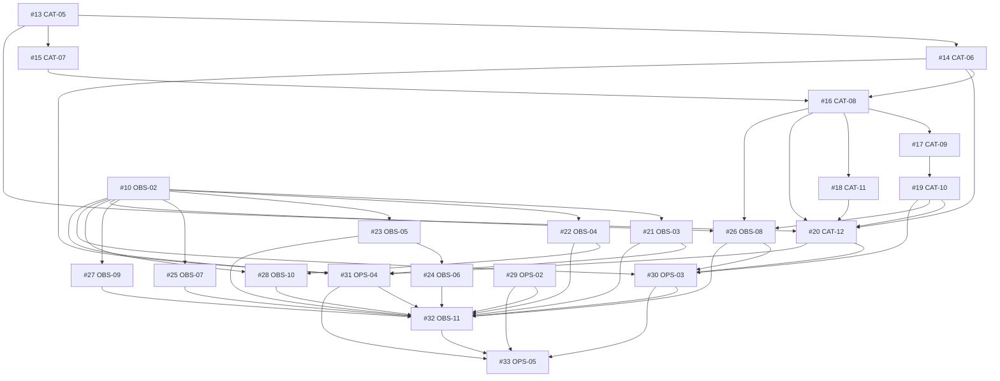

# Estado de implementação — Jogo da Música

Conferência em **26/09/2026**, por Git local, referências atualizadas do remoto,
issues, PRs, GitHub Actions e registros de deployment. Este documento reconcilia
os planos históricos; a implementação e os critérios de cada entrega continuam
nas respectivas issues. Não é uma nova auditoria de segurança ou QA de produção.

## Base integrada e publicação

- Base remota: `63b0fa5270b8cb3dbedb57c78c0535997e901f7b` em `origin/master`.
- [PR #50](https://github.com/leothefranco/jogodamusica/pull/50) integrada:
  animações entre etapas, marca unificada e link na imagem de vitória.
- [CI do master](https://github.com/leothefranco/jogodamusica/actions/runs/35945299311)
  aprovado em 24/09/2026 UTC: formatação, lint, tipos, testes, builds e Playwright.
- Deployment GitHub `6628494008`, ambiente `Production`, no mesmo SHA:
  `success` em 24/09/2026 UTC. Isso comprova o registro do deployment; não é uma
  nova inspeção do alias, do navegador ou de dispositivos reais.
- PRs #46–#49 também integradas: identidade editorial, duelo azul × laranja,
  refinamento mobile e UI-REFINO-02. O contrato vigente está em
  [UI-REFINO-02](./design/ui-complete-refinement.md), com
  [evidências de QA](./qa/ui-complete-refinement.md).

## Como interpretar os planos

1. A [especificação original](../jogo-da-musica-especificacao-codex.md) descreve as
   fases do MVP. O código das fases 0–5 existe; CI, E2E e deployments da fase 6
   também existem. A aprovação integral do QA externo não está consolidada no
   checklist versionado.
2. O [plano de melhorias de 11/08](./plano-melhorias-projeto.md) é histórico.
   Contagens de testes, vulnerabilidades, falhas e estimativas são daquela data.
3. O [plano mestre de 24/08](https://github.com/leothefranco/jogodamusica/blob/a1c3ecd987818c38863d0f8c0ed2ec52c3ed82e7/docs/plano-mestre-evolucao-2026-08-24.md)
   e as specs da **Fase 0 de evolução** estão na
   [PR #34](https://github.com/leothefranco/jogodamusica/pull/34), ainda aberta e
   com conflitos. Essa Fase 0 não é a fundação concluída do MVP.
4. A execução desse pacote está nas issues #5–#33: **29 tickets, 7 encerrados e
   22 abertos**. SEC-02 #42 é uma correção adicional, também encerrada.

O plano de evolução avança por critérios de saída e dependências, sem datas-alvo.
As fases posteriores tratam confiança na partida, fundação editorial/admin,
taxonomia/busca, experiência visual, catálogo canônico, recomendação e operação.
Entregas visuais antecipadas não encerram automaticamente as fases de catálogo
ou observabilidade.

## Ledger do pacote de evolução

Uma dependência se satisfaz com a entrega integrada e a issue encerrada; código
local ou uma PR aberta não liberam os tickets seguintes. A tabela lista somente
blockers ainda abertos. Os requisitos completos permanecem no tracker.

| Ticket     | Estado em 26/09                            | Blockers abertos / próxima prova                                                         |
| ---------- | ------------------------------------------ | ---------------------------------------------------------------------------------------- |
| REL-02 #5  | Concluído                                  | Contrato de arquivos especiais integrado                                                 |
| AST-01 #6  | Concluído                                  | Capa gerenciada na criação integrada                                                     |
| AST-02 #7  | Concluído                                  | Recuperação de imagens integrada                                                         |
| CAT-02 #8  | Concluído                                  | Proteção pública contra tema não jogável integrada                                       |
| CAT-03 #9  | Concluído                                  | Disponibilidade regional BR e frescor integrados                                         |
| OBS-02 #10 | Estacionado; PR #37 conflitante            | Atualizar/revisar PR e comprovar retenção operacional antes de rollout externo           |
| REL-01 #11 | Concluído                                  | Patch e gate de segurança integrados                                                     |
| CAT-04 #12 | Concluído                                  | Publicação, visibilidade e saúde separadas                                               |
| CAT-05 #13 | Retomado; implementação local em validação | Sem blocker de issue; entregar e revisar sobre a base atual                              |
| CAT-06 #14 | Bloqueado                                  | #13                                                                                      |
| CAT-07 #15 | Bloqueado                                  | #13                                                                                      |
| CAT-08 #16 | Bloqueado                                  | #14, #15                                                                                 |
| CAT-09 #17 | Bloqueado                                  | #16                                                                                      |
| CAT-11 #18 | Bloqueado                                  | #16                                                                                      |
| CAT-10 #19 | Bloqueado                                  | #17                                                                                      |
| CAT-12 #20 | Bloqueado                                  | #13, #14, #16, #18, #19                                                                  |
| OBS-03 #21 | Bloqueado                                  | #10                                                                                      |
| OBS-04 #22 | Bloqueado                                  | #10                                                                                      |
| OBS-05 #23 | Bloqueado                                  | #10                                                                                      |
| OBS-06 #24 | Bloqueado                                  | #23                                                                                      |
| OBS-07 #25 | Bloqueado                                  | #10                                                                                      |
| OBS-08 #26 | Bloqueado                                  | #10, #16, #19                                                                            |
| OBS-09 #27 | Bloqueado                                  | #10                                                                                      |
| OBS-10 #28 | Bloqueado                                  | #10, #22                                                                                 |
| OPS-02 #29 | Disponível; fora desta rodada              | #5 e #11 já encerradas; CI existente não satisfaz sozinho o orquestrador completo pedido |
| OPS-03 #30 | Bloqueado                                  | #10, #19, #20, #26                                                                       |
| OPS-04 #31 | Bloqueado                                  | #10, #14, #20, #21; ambiente QA apropriado                                               |
| OBS-11 #32 | Bloqueado                                  | #21–#31                                                                                  |
| OPS-05 #33 | Bloqueado                                  | #29, #30, #31, #32                                                                       |

## Rodada atual: CAT-05

Um ticket de produto ativo, dentro do limite de dois. OPS-02 é elegível, mas fica
fora desta rodada para concluir a entrega existente; OBS-02 permanece estacionado.

- Escritor original: tarefa `01a044cd-6c63-7312-8fa1-46081f02ccd1`, modelo
  `gpt-6-astra`, esforço existente preservado.
- Branch `codex/issue-13-cat-05`, worktree
  `C:/Users/LEOFR/.codex/worktrees/d3cd/Jogo da música`.
- Base atualizada por fast-forward de `c47fec1` para `63b0fa5`; os nove arquivos
  modificados e dois novos foram preservados e reaplicados. Conflito da home
  resolvido mantendo BrandMark, CSS atual e quatro capas, com paginação CAT-05.
- Handshake recebido: base e branch corretas, sem conflitos ou alterações staged,
  issue atual sem alteração de requisitos; suíte focal iniciada antes de editar.
- Escopo: consulta autoritativa BR, classificador único CAT-04, modalidades e
  thumbnails jogáveis, allowlist, paginação sem N+1, métricas e tracer home→tema.
- O modo legado permanece padrão; ativação pública pertence à CAT-12 #20.
- Próxima prova: handoff local com critérios→testes, gates e commit para revisão.
  Handoff não significa merge, deployment ou encerramento da issue.

## Reconciliação local e preservação

O checkout principal usa `codex/reconcile-plans-20260926`, baseada em `63b0fa5`.
O `master` local foi atualizado para o mesmo commit. O código de produto neste
checkout coincide com o remoto; os ajustes desta branch são de documentação.

Antes da sincronização foram preservados todos os arquivos locais, com manifesto
SHA256, patch binário e stash, em `tmp/reconciliation-20260926/` (ignorado pelo Git):

- Principal: stash `cd36c5579fe9c5ecbc66bb10096b49a55a83119e`;
  18 arquivos modificados e 7 novos. Quinze já eram idênticos ao remoto, cinco
  arquivos de código/teste correspondiam a versões anteriores das entregas
  integradas; os documentos, a regra de modelo e a referência visual foram
  restaurados. A pesquisa de publicação permanece local e não rastreada.
- CAT-05: stash `204b07e00758df850373a258f4c77d6f908d3e53`, onze arquivos.
  O stash continua preservado depois de reaplicar o trabalho.

As branches históricas e os demais worktrees foram mantidos. O protótipo
`codex/prototype-cartaz-contemporaneo` conserva cinco commits exclusivos.
PR #34 e PR #37 permanecem conflitantes; seus checks antigos não validam uma
futura resolução contra o master atual.

## Limites de evidência

Esta reconciliação não executou migrations, consultas ao banco real, smoke de
produção nem nova auditoria de dependências. CI verde e deployment registrado
não comprovam os critérios operacionais pendentes de OBS/OPS, nem encerram o
[QA externo](./qa-externo-fase-6.md).
