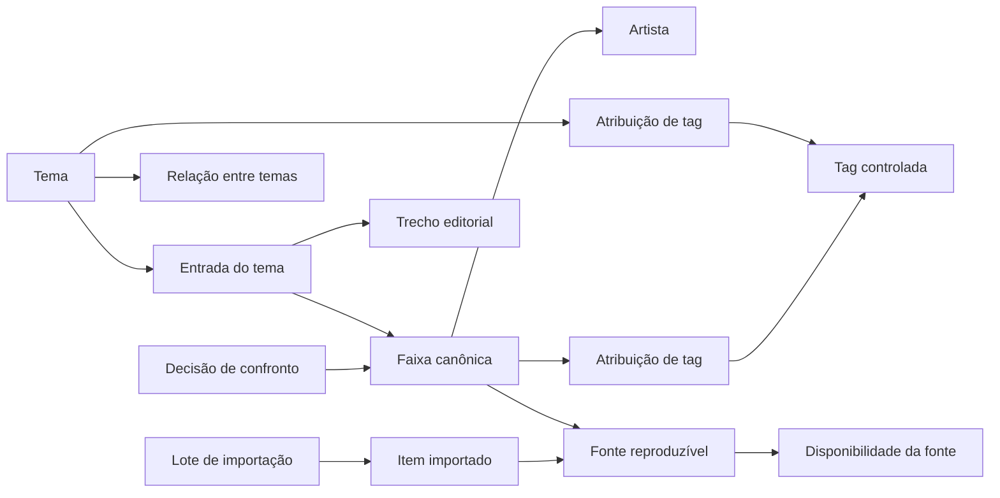

# Plano mestre de evolução — Jogo da Música

Data da auditoria: 24 de agosto de 2026

Base validada: commit 2cb8aab

Horizonte: estabilização imediata, evolução do produto e fundação de catálogo

## 1. Resumo executivo

O Jogo da Música já tem um núcleo funcional melhor do que sua aparência sugere. A
partida sem cadastro, os dois players, a exclusão mútua de áudio, o corte de
trechos, a confirmação de voto, o Desempate, o Sorteio entre rodadas, o snapshot
da sessão, o PWA e o respeito a movimento reduzido formam uma boa base.

O próximo salto não deve ser tratado como uma simples repaginada. Há cinco
frentes conectadas:

1. **Confiabilidade do catálogo:** um tema publicado pode ficar com menos de
   quatro fontes reproduzíveis sem ser despublicado de forma efetiva.
2. **Clareza e recuperação da partida:** os modos escondem o número real de
   duelos, falhas de player não oferecem retry real e não há retomada simples.
3. **Operação editorial:** o painel e a importação não escalam; falta separar
   conteúdo importado, aprovado, disponível e publicado.
4. **Descoberta e identidade:** a experiência é coerente, mas genérica; faltam
   busca, taxonomia, relações e uma linguagem visual própria.
5. **Segurança e operação:** há bons controles básicos, porém RBAC, capability de
   controle da partida, ciclo de vida de assets, mínimo privilégio e observabilidade
   ainda precisam amadurecer.

### Recomendação central

Executar em camadas: corrigir invariantes e riscos de release, tornar a partida
confiável, estruturar a operação editorial, lançar busca e descoberta, aplicar a
nova identidade e só então ativar recomendações adaptativas. Um grande redesign
ou um algoritmo sofisticado antes dessa fundação aumentaria retrabalho e esconderia
problemas de dados.

## 2. Escopo e método

Esta avaliação combinou:

- leitura de domínio, schema, repositórios, serviços, rotas e testes;
- auditoria de segurança, arquitetura, banco, catálogo e operação;
- inspeção visual em mobile e desktop da home, catálogo, tema, login e fixture do
  jogo;
- revisão de responsividade, acessibilidade, UI, UX e jogabilidade;
- revalidação específica da correção de capas mergeada no commit 2cb8aab;
- comparação com o plano de 11 de agosto de 2026 para não reabrir itens já
  resolvidos;
- leitura da documentação local da versão instalada do Next.js e das orientações
  oficiais atuais de Next.js e Supabase.

Não houve alteração de código ou de dados nesta auditoria.

### Evidências dos gates em 24/08/2026

- Prettier do plano: aprovado.
- ESLint: aprovado.
- TypeScript isolado: aprovado antes de o Next regenerar os tipos de rotas.
- Vitest: 34 arquivos e 166 testes aprovados.
- Build padrão/Turbopack: interrompido por limitação do sandbox do Windows ao
  criar um processo, antes de compilar a aplicação.
- Build com Webpack: compilou o código e então revelou um blocker real de tipo.
  Seis arquivos especiais route.ts exportam factories auxiliares que o Next.js
  16.3 não aceita. São os manifests público/admin e as rotas de busca, resolução,
  preview e importação de playlist. As factories devem morar em módulos comuns e
  os arquivos de rota devem exportar apenas handlers/configuração suportados.

O sucesso do TypeScript isolado não substitui next build, porque os tipos de
arquivos especiais são gerados pelo framework durante o build/typegen.

## 3. O que deve ser preservado

| Capacidade atual                                    | Motivo para preservar                            |
| --------------------------------------------------- | ------------------------------------------------ |
| Partida sem conta                                   | Reduz drasticamente a fricção social             |
| Snapshot das músicas da sessão                      | Mantém o resultado histórico estável             |
| Decisão transacional com lock e compare-and-set     | Evita votos concorrentes e perda de atualização  |
| Dois players com pausa mútua                        | Corresponde ao modelo mental de comparação A × B |
| Corte automático do trecho                          | Mantém a partida controlável                     |
| Confirmação acessível de voto e abandono            | Reduz erro irreversível                          |
| Desempate persistido e Sorteio por rodada           | Atende às regras já definidas                    |
| Reduced motion, skip link e alvos de toque          | Boa base de acessibilidade                       |
| Rate limit atômico em Postgres e Retry-After        | Corrige o antigo limite apenas em memória        |
| Request ID, redaction e logging estruturado parcial | Base útil para observabilidade                   |
| RLS habilitado e policies restritas no Storage      | Boa intenção de isolamento                       |

O relatório histórico docs/Correções.pdf pedia pausa, dois players, 64/128 músicas,
popup interno, retomada da posição do vídeo, empate/roleta e reembaralhamento das
rodadas. Esses itens estão implementados e não devem voltar ao backlog como se
fossem pendências.

## 4. Revalidação da correção de capas

A correção recém-mergeada foi reavaliada contra o estado atual.

| Fluxo                                         | Estado    |
| --------------------------------------------- | --------- |
| Capa personalizada prevalece sobre thumbnails | Corrigido |
| Sem capa, usar até quatro thumbnails          | Corrigido |
| Sem capa nem thumbnails, fallback editorial   | Corrigido |
| Upload na edição, caminho feliz               | Funciona  |
| Upload na criação                             | Quebrado  |
| Fallback após erro 404/decodificação da capa  | Ausente   |
| Limpeza ao substituir/remover/excluir         | Ausente   |
| Limpeza após validação ou persistência falhar | Ausente   |

### Defeito imediato

O formulário envia o arquivo ao Storage e adiciona coverUrl ao FormData, mas a
action de criação chama themeInputFromFormData com null. O tema nasce sem capa e
o objeto enviado fica órfão. Os testes atuais validam upload e apresentação, mas
não cobrem a persistência completa formulário → Server Action → banco.

### Correção sustentável

1. Corrigir a criação antes do próximo release.
2. Guardar bucket e object_key gerenciados, mantendo cover_url apenas para leitura
   legada durante a migração.
3. Fazer a Server Action confirmar que o objeto pertence ao bucket e ao prefixo do
   usuário autenticado.
4. Implementar intenção temporária de upload e finalização após a persistência.
5. Remover o novo objeto quando a operação falhar.
6. Remover o objeto anterior depois que a substituição for confirmada.
7. Limpar assets ao remover a capa ou excluir o tema.
8. Executar garbage collection periódico de objetos não referenciados.
9. Cair para thumbnails quando a capa falhar ao carregar.
10. Persistir dimensões, checksum e ponto focal para os formatos 16:9 e 9:16.

## 5. Destino do produto

### Promessa recomendada

> Transformar qualquer encontro em uma disputa musical envolvente, clara e
> compartilhável — sem cadastro e com uma campeã que o grupo realmente escolheu.

### Público inicial recomendado

- grupos presenciais usando um único aparelho;
- partidas de 32 e 64 músicas como as duas experiências principais;
- modos de 4, 8 e 16 músicas como alternativas rápidas, sem substituir o destaque
  dos modos principais;
- sessões preparadas para pausa, retomada e checkpoints entre rodadas;
- operação editorial curada por uma equipe pequena;
- experiência anônima, com retomada local, antes de qualquer sistema de contas.

### Resultados de produto

| Resultado                               | Indicador inicial                                             |
| --------------------------------------- | ------------------------------------------------------------- |
| Encontrar uma disputa rapidamente       | mediana tema visto → partida iniciada menor que 30 s          |
| Entender o compromisso antes de começar | todos os modos exibem músicas, duelos e tempo estimado        |
| Concluir partidas principais            | conclusão de 32/64 e abandono por rodada/quartil              |
| Recuperar falhas sem desistir           | taxa de retry bem-sucedido e abandono após erro de player     |
| Manter catálogo jogável                 | 99% dos temas visíveis com pelo menos quatro fontes saudáveis |
| Operar centenas de músicas              | busca/filtro percebido abaixo de 100 ms e DOM limitado        |
| Descobrir conteúdo relevante            | zero-result, CTR de tema e start após busca                   |
| Compartilhar o resultado                | share intent, share completion e visitas atribuídas           |
| Evitar concentração algorítmica         | exposição por faixa e Gini de exposição                       |

## 6. Prioridades consolidadas

### P0 — bloqueadores de release ou de integridade

| ID     | Problema                                                           | Ação                                                                               |
| ------ | ------------------------------------------------------------------ | ---------------------------------------------------------------------------------- |
| REL-01 | Next.js 16.3.0 aguarda patch crítico anunciado para 26/08/2026     | bloquear promoção até a versão corrigida, fixar lockfile e executar todos os gates |
| REL-02 | build rejeita exports auxiliares em seis arquivos route.ts         | mover factories e deixar os arquivos especiais apenas com exports aceitos          |
| AST-01 | criação com capa perde a referência e gera órfão                   | corrigir persistência e adicionar teste integrado                                  |
| CAT-01 | tema publicado pode ficar com menos de quatro fontes reproduzíveis | tornar visibilidade uma projeção derivada de publicação editorial + saúde          |
| SEC-01 | URL/UUID da sessão também funciona como poder de mutação           | separar link público e capability secreta de controle                              |
| SEC-02 | rate limit por recurso permite alta cardinalidade                  | adicionar limite global por IP+rota e controle de cardinalidade                    |

### P1 — confiança, operação e acessibilidade

| ID      | Problema                                                | Ação                                                                 |
| ------- | ------------------------------------------------------- | -------------------------------------------------------------------- |
| GAME-01 | mensagem de erro sugere retry que não existe            | adicionar retry/reload real por player                               |
| GAME-02 | falha de decisão aparece atrás do diálogo               | erro e retry dentro do diálogo ativo                                 |
| GAME-03 | saída acidental perde a sessão                          | retomada local e confirmação em toda navegação interna               |
| GAME-04 | rodadas escondem o número e a duração dos duelos        | destacar 32/64 com 31/63 duelos e tempo estimado                     |
| GAME-05 | Sorteio entre rodadas não é explicado                   | interstício acessível com classificados e embaralhamento             |
| A11Y-01 | navegação admin perde nome acessível no mobile          | labels persistentes, aria-current e testes em 320 px                 |
| A11Y-02 | textos de baixa opacidade falham contraste              | tokens semânticos validados em WCAG 2.2 AA                           |
| ADM-01  | um formulário completo por música não escala            | lista virtualizada/paginada, busca, filtros, lote e edição em drawer |
| ADM-02  | playlist de até mil itens é difícil de revisar          | job recuperável, virtualização, filtros e progresso                  |
| DATA-01 | importado entra ativo sem revisão editorial             | estados pending_review, approved, rejected e retired                 |
| DATA-02 | decisão humana e Desempate são indistinguíveis no banco | persistir decision_type e excluir sorteios dos sinais de preferência |
| DATA-03 | disponibilidade é um booleano global insuficiente       | saúde, região, motivo e last_verified_at por fonte                   |
| SEC-03  | admin/editor têm o mesmo poder efetivo                  | matriz de permissões e requirePermission central                     |
| SEC-04  | login admin sem MFA e defesa progressiva                | AAL2, limiter e CAPTCHA conforme risco                               |
| SEC-05  | runtime do banco não demonstra mínimo privilégio        | role DML própria, grants explícitos e testes RLS                     |
| OBS-01  | nem todo 5xx e Server Action entra no mesmo reporter    | reporter único, correlação, métricas e alertas                       |

### P2 — diferenciação, descoberta e escala

| ID         | Problema                                   | Ação                                              |
| ---------- | ------------------------------------------ | ------------------------------------------------- |
| BRAND-01   | identidade dark/neon/glass é genérica      | sistema “Cartaz de Duelo / Festival Bracket”      |
| DISC-01    | catálogo é apenas uma grade alfabética     | busca, facetas, chips, continuar e quick-start    |
| DISC-02    | não existem tags controladas nem relações  | taxonomia facetada, aliases e relações editoriais |
| SHARE-01   | compartilhar apenas baixa/abre imagem      | Web Share, copiar link, QR e metadata específica  |
| RESULT-01  | até 127 cards formam uma grade plana       | agrupar por rodada e colapsar histórico           |
| REMATCH-01 | revanche exige refazer escolhas            | um toque, mesmo tamanho e penalização de vistos   |
| PERF-01    | estado completo volta a cada decisão       | read model consistente e resposta incremental     |
| PERF-02    | endpoint de imagem recalcula PNG caro      | resultado imutável/cacheado e limite de geração   |
| PERF-03    | importação faz muitos round trips sob lock | operação set-based em lotes limitados             |
| QA-01      | E2E real não cobre jornadas completas      | tracer público/admin, axe, mobile e banco real    |

### P3 — inteligência adaptativa e hardening contínuo

| ID       | Problema                                            | Ação                                               |
| -------- | --------------------------------------------------- | -------------------------------------------------- |
| MODEL-01 | song representa fonte do YouTube, não faixa         | migrar para Faixa canônica + Fonte reproduzível    |
| ALG-01   | sorteio uniforme não controla diversidade/exposição | política versionada discovery_balanced             |
| ALG-02   | não há força de faixa por tema                      | taxa suavizada e depois Bradley–Terry regularizado |
| ALG-03   | não há recomendação de próximo tema                 | conteúdo/contexto primeiro, comportamento depois   |
| HARD-01  | CSP usa unsafe-inline e wildcard de Supabase        | origem exata e nonce/hash em report-only           |
| GOV-01   | retenção, auditoria e restauração não formalizadas  | políticas, jobs, audit trail e runbook RPO/RTO     |

## 7. Modelo de domínio alvo

O modelo atual mistura a identidade musical com uma fonte do YouTube. A evolução
deve separar a música que as pessoas reconhecem da mídia que o player consegue
reproduzir.



### Vocabulário proposto

| Termo                | Definição                                                        |
| -------------------- | ---------------------------------------------------------------- |
| Tema                 | coleção editorial jogável, com identidade e regras de descoberta |
| Faixa canônica       | identidade musical independente de provedor ou upload            |
| Artista              | pessoa ou grupo creditado na faixa                               |
| Fonte reproduzível   | vídeo/áudio de um provedor capaz de tocar a faixa                |
| Entrada do tema      | inclusão editorial de uma faixa em um tema                       |
| Trecho editorial     | início, fim e justificativa do recorte usado no jogo             |
| Disponibilidade      | saúde técnica e territorial de uma fonte em um instante          |
| Aprovação editorial  | decisão humana sobre a adequação da entrada                      |
| Lote de importação   | operação rastreável que trouxe itens externos                    |
| Decisão de confronto | voto humano ou Desempate aleatório imutável                      |

Esses termos são propostas. Devem ser aprovados antes de alterar CONTEXT.md e o
schema.

### Entidades e campos incrementais

#### Curto prazo, sem quebrar o modelo atual

- theme_songs:
  - review_status;
  - reviewed_by e reviewed_at;
  - rejection_reason;
  - added_via e import_batch_id;
  - version e retired_at.
- songs/fontes:
  - availability_status;
  - availability_reason;
  - region;
  - last_verified_at;
  - provider_metadata_updated_at.
- game_matches:
  - decision_type: vote, tiebreak ou unknown para legado;
  - decision_policy_version;
  - decided_at.
- game_sessions:
  - selection_policy;
  - selection_policy_version;
  - control_token_hash;
  - public_result_id ou read capability separada.
- themes:
  - editorial_status separado da visibilidade efetiva;
  - searchable_document;
  - published_at e suspended_at.
- assets:
  - bucket, object_key, checksum, MIME, largura, altura;
  - focal_x, focal_y;
  - status temporário/final/orphaned;
  - owner e timestamps.

#### Médio prazo

- artists e track_artists;
- canonical_tracks;
- playable_sources ligadas à faixa canônica;
- source_availability_history;
- tags, tag_aliases e tag_relations;
- theme_tags e track_tags;
- theme_relations;
- import_batches e import_items;
- admin_audit_log;
- product_events e agregados anônimos.

### Migração sem big bang

1. Expandir o schema com colunas e tabelas opcionais.
2. Preencher saúde, revisão, proveniência e decision_type.
3. Fazer dual-read das capas e dual-write dos novos assets.
4. Introduzir faixa canônica opcional e backfill assistido.
5. Detectar candidatos a duplicata sem mesclar automaticamente.
6. Revisar merges no admin.
7. Alterar leituras para o modelo novo atrás de feature flag.
8. Medir divergência durante uma janela de convivência.
9. Fazer cutover por fatia e manter rollback.
10. Remover o legado somente após cobertura e auditoria.

## 8. Publicação e saúde do catálogo

O estado publicado não pode significar simultaneamente “aprovado pelo editor” e
“jogável agora”.

### Regra recomendada

```text
visível_publicamente =
  editorial_status == published
  AND quantidade_de_entradas_aprovadas_com_fonte_saudável >= 4
```

### Comportamento

- o editor publica a intenção editorial;
- uma projeção calcula a jogabilidade efetiva;
- se uma fonte global mudar de saúde, todos os temas que a utilizam são
  recalculados;
- um tema abaixo do mínimo é suspenso da descoberta, mas não perde sua intenção
  editorial;
- o painel mostra motivo, impacto e ação sugerida;
- alertas identificam temas degradados e fontes compartilhadas críticas;
- um job revalida fontes por prioridade, recência e popularidade.

### Critérios de aceite

- nenhuma consulta pública retorna tema com menos de quatro entradas aprovadas e
  saudáveis;
- revalidar uma fonte recalcula todos os temas dependentes;
- a operação é idempotente e observável;
- o painel distingue publicado, visível, degradado e suspenso;
- testes cobrem uma fonte compartilhada por vários temas.

## 9. Taxonomia, tags e relações

### Facetas controladas

| Faceta  | Exemplos                                     |
| ------- | -------------------------------------------- |
| gênero  | pop, rock, funk, sertanejo, MPB, eletrônico  |
| época   | 70s, 80s, 90s, 2000s, 2010s, atual           |
| humor   | eufórico, romântico, nostálgico, melancólico |
| ocasião | churrasco, viagem, festa, academia, karaokê  |
| idioma  | português, inglês, espanhol                  |
| região  | Brasil, América Latina, global               |
| público | família, adulto, infantil                    |

### Regras

- tag tem nome, slug, faceta, parent_id, status e aliases;
- nomes livres entram como sugestão, nunca diretamente como produção;
- atribuições inferidas guardam origem, confiança e review_status;
- popular, novo e tendência são métricas, não tags;
- sinônimos e grafias alternativas vivem em aliases;
- relações entre temas têm tipo, peso, origem e validade;
- exclusões editoriais devem poder impedir uma recomendação automática.

### Governança

- somente administradores gerenciam a estrutura da taxonomia;
- editores atribuem tags existentes;
- relatório periódico identifica tags órfãs, duplicadas e excessivamente amplas;
- mudanças estruturais são auditadas e reversíveis.

## 10. Pesquisa

### Versão 1: PostgreSQL antes de motor externo

- tsvector ponderado com configuração em português e unaccent;
- pg_trgm para prefixos, erros de digitação e nomes curtos;
- índices GIN e trigram conforme EXPLAIN ANALYZE;
- busca em tema, aliases, tags, artista e faixa;
- projeção de busca estável para não acoplar a UI ao schema legado;
- paginação por cursor;
- filtros em URL para permitir voltar, compartilhar e medir.

### Ordem de relevância

1. correspondência exata de título/alias;
2. prefixo do título;
3. tag controlada;
4. artista ou faixa presente;
5. descrição;
6. popularidade apenas como desempate.

### Experiência

- busca única na home;
- chips de ocasião, humor, época e tempo disponível;
- estado vazio com correção de grafia e facetas próximas;
- quick-start por duração e tamanho de grupo;
- “Continuar partida” antes de rails editoriais;
- no máximo dois ou três grupos editoriais, evitando uma home de streaming
  excessivamente fragmentada.

### Critérios de aceite

- busca p95 abaixo de 250 ms no volume de referência;
- corpus de consultas conhecidas encontra o resultado esperado no top 3 em pelo
  menos 95% dos casos;
- nenhum full scan nas consultas principais;
- zero-result e click-through instrumentados sem registrar texto livre por padrão;
- teclado e leitor de tela cobrem busca, filtros e remoção de chips;
- filtros sobrevivem a voltar/avançar e geram URLs estáveis;
- paginação por cursor não duplica nem omite itens.

## 11. Recomendação e algoritmos

Não deve existir um único “algoritmo do jogo”. Há quatro problemas diferentes.

### 11.1 Ranking de busca

Objetivo: responder à intenção explícita.

Sinal primário: texto e taxonomia.

Popularidade: apenas desempate para não sufocar temas novos.

### 11.2 Próximo tema

Versão inicial:

- overrides editoriais;
- similaridade ponderada de tags;
- pequena contribuição de sobreposição de faixas;
- diversidade e penalização do tema recém-jogado;
- contexto local, como duração escolhida;
- nenhuma personalização por identidade antes de haver consentimento e valor
  demonstrado.

### 11.3 Seleção de candidatas para a partida

Preservar random_uniform como baseline versionada. Adicionar depois uma política
discovery_balanced com amostragem sem reposição e pesos para:

- déficit de exposição;
- saúde da fonte;
- aprovação editorial;
- diversidade de artista e tag;
- penalização de itens vistos recentemente no aparelho;
- limite de repetição entre revanches.

Persistir a política e sua versão na sessão para reprodução e análise.

### 11.4 Força da faixa dentro do tema

- contar apenas votos humanos;
- Desempate não altera força;
- começar com taxa suavizada, intervalo de Wilson ou posterior Beta;
- migrar para Bradley–Terry regularizado quando o grafo tiver densidade;
- manter score por tema, não apenas global;
- exibir incerteza internamente;
- nunca transformar ranking em verdade editorial.

### Guardrails

- medir Gini de exposição;
- reservar tráfego para exploração;
- não treinar com eventos sem versão de política;
- separar clique, conclusão e preferência;
- evitar dados livres e identificadores pessoais;
- documentar hipóteses e rollback de cada experimento.

## 12. Jogabilidade e UX

### 12.1 Modos compreensíveis

O torneio de N músicas exige N − 1 duelos. Com 30 segundos por trecho, 4, 8, 16,
32, 64 e 128 músicas já exigem aproximadamente 3, 7, 15, 31, 63 e 127 minutos de
áudio, antes de conversa, confirmação e transições.

Hierarquia recomendada:

- 32 músicas — 31 duelos — modo principal;
- 64 músicas — 63 duelos — modo principal;
- 4, 8 e 16 músicas — alternativas rápidas;
- 128 músicas — alternativa de maior escala, com menor proeminência até haver
  dados de conclusão.

32 e 64 não devem ficar escondidos, agrupados como “Maratona” nem atrás de
revelação progressiva. Cada opção deve mostrar tempo estimado calculado pela soma
dos trechos e ajustado pelos dados reais de conversa e decisão. Com trechos médios
de 30 segundos para cada competidora, o piso de áudio já é de aproximadamente 31
minutos para 32 músicas e 63 minutos para 64; o tempo social real será maior.

### 12.2 Ritmo de uma sessão principal

- checkpoint visível ao fim de cada rodada;
- opção de pausar e continuar mais tarde sem abandonar;
- resumo das classificadas antes do Sorteio seguinte;
- tempo restante recalculado a partir do ritmo observado;
- estado resistente a reload, suspensão do navegador e oscilação de rede;
- nenhuma dependência de manter a tela acordada durante toda a partida;
- telemetria de conclusão e abandono por rodada, não apenas por modo.

### 12.3 Recuperação

- retry/reload real no player com estado carregando;
- “continuar sem ouvir” como escolha consciente, não comportamento implícito;
- erro de decisão dentro do diálogo, com Tentar novamente e Cancelar;
- request idempotente e proteção contra voto duplicado;
- persistência local da sessão ativa;
- CTA “Continuar [tema]” na home;
- abandono limpa a retomada;
- navegação pela marca durante a partida passa pela mesma confirmação.

### 12.4 Clareza e justiça

- A usa coral e B usa ciano, sempre acompanhados de letra, título e artista;
- botões dizem “Escolher «título»”, não apenas “Votar A/B”;
- empate permanece textual: “Não decidimos · sortear”;
- mostrar duração do trecho e estado ouvido de A/B;
- não bloquear voto, mas alertar se alguém ainda não foi ouvido;
- ao fim da rodada, mostrar classificados e explicar o embaralhamento;
- resultado agrupa partidas por rodada, porque não há chave fixa clássica;
- persistir se a decisão foi voto ou Desempate.

### 12.5 Foco e anúncios

- após confirmação, focar o título do novo confronto;
- no fim da rodada, focar o anúncio da transição;
- revelar Desempate uma vez em região apropriada;
- manter erro e ação de recuperação no elemento modal ativo;
- testar apenas teclado, NVDA/Chrome e VoiceOver ou TalkBack.

## 13. Responsividade e acessibilidade

### Matriz mínima

- 320 × 568;
- 360 × 640;
- 390 × 844;
- 768 px;
- 1280 × 720 e 1280 × 800;
- retrato e paisagem;
- zoom de 200% e 400%;
- teclado aberto no mobile.

### Requisitos

- nenhum scroll horizontal;
- nenhum controle coberto por barra sticky;
- navegação admin com nome acessível mesmo quando o texto visual some;
- aria-current no item ativo;
- erros ligados por aria-describedby;
- summary de erros com foco no primeiro campo inválido;
- label real para upload;
- contraste WCAG 2.2 AA;
- alvos de toque mínimos preservados;
- reduced motion muda animação, não remove informação;
- heading e foco determinísticos em transições.

### Jogo em tela curta

O scroll atual é um trade-off deliberado para manter os dois players. A melhoria
recomendada não é esconder um player:

- header em duas linhas;
- barra de decisão sticky sem cobrir iframe;
- links “Ir para A” e “Ir para B”;
- cards mais distintos e compactos;
- teste com YouTube, teclado, paisagem e safe areas.

## 14. Identidade visual

### Direção recomendada: Cartaz de Duelo / Festival Bracket

Misturar cartaz de festival brasileiro e lambe-lambe com placar de torneio:
blocos de tinta, textura halftone discreta, recortes diagonais e linhas de chave
como assinatura.

### Princípios

1. música e disputa reconhecíveis mesmo sem o logotipo;
2. calor humano e energia de encontro, não aparência de dashboard de IA;
3. contraste alto e informação legível antes de efeitos;
4. A e B com identidades funcionais próprias;
5. resultado com valor de pôster compartilhável;
6. admin como “bastidores”: mais calmo e denso, mas pertencente à mesma marca.

### Sistema proposto para protótipo

| Token              | Uso                                      |
| ------------------ | ---------------------------------------- |
| tinta quase preta  | fundo e texto sobre cores vivas          |
| creme quente       | superfícies editoriais e texto principal |
| coral              | competidora A                            |
| ciano              | competidora B                            |
| ouro ou lima ácida | vitória, campeão e progresso concluído   |
| violeta            | acento secundário, não cor universal     |

Valores exatos devem passar por contraste automatizado e teste em OLED/sol antes
de serem congelados.

Tipografia candidata:

- display condensada de cartaz/placar;
- corpo de alta legibilidade;
- fontes self-hosted e subsetadas após validação de licença e performance;
- Barlow Condensed + Atkinson Hyperlegible como hipótese, não decisão final.

Marca:

- símbolo que combine waveform, duas chaves opostas e coroa/play;
- wordmark próprio;
- versão reduzida maskable para PWA;
- assinatura visual aplicável sem depender do logo.

### Aplicação por superfície

| Superfície   | Direção                                                    |
| ------------ | ---------------------------------------------------------- |
| Home         | pôster vivo da disputa, busca e quick-start                |
| Card de tema | cartaz colecionável com tags, duração e saúde de imagem    |
| Jogo         | placar A × B, ações explícitas e progresso de rodada       |
| Resultado    | pôster de campeã com QR, share e resumo por rodada         |
| Admin        | bastidores operacionais com alta densidade e mesmos tokens |

### Processo

1. criar no máximo duas direções:
   - A — Cartaz de Festival, recomendada;
   - B — Placar Neon, alternativa conservadora;
2. testar reconhecimento sem logo, legibilidade, associação “música + disputa” e
   vontade de compartilhar;
3. escolher uma direção inteira;
4. transformar em tokens, componentes e guidelines;
5. pilotar home + confronto + pôster de resultado;
6. expandir para catálogo e admin;
7. eliminar gradualmente estilos legados, sem misturar os dois sistemas.

## 15. Painel e facilidade de cadastro

### Lista de temas

- busca por nome, slug, tag e faixa;
- filtros: rascunho, pronto, degradado, suspenso e precisa de atenção;
- ordenação por atualização, saúde, volume e pendências;
- CTA de retomar a última edição;
- ações em lote reversíveis;
- resumo operacional no dashboard.

### Editor de conteúdo

- paginação ou virtualização;
- busca por título, artista, provider ID e tag;
- filtros por revisão, disponibilidade, erro e origem;
- seleção em lote;
- drawer de edição com player e preview do trecho;
- salvamento inline com feedback e undo;
- scroll e foco preservados;
- teste com mil entradas e títulos extremos.

### Importação

- criar import_batch antes de consultar o provedor;
- executar fora de uma transação longa;
- processar em chunks e operações set-based;
- mostrar progresso e permitir retomada;
- itens entram pending_review;
- thumbnails, duração, motivo de rejeição e filtros;
- seleção por filtro com contagem explícita;
- nenhum item invisível selecionado sem indicação;
- proveniência, operador, horário e política versionados.

### Cadastro individual

- resolução de URL/ID separada da aprovação;
- sugestão de título/artista, nunca confirmação silenciosa;
- preview do corte com waveform/tempo;
- default de trecho inteiro tratado como decisão de produto;
- detecção de duplicata por fonte e candidato a faixa canônica;
- validação de disponibilidade antes da aprovação.

## 16. Segurança, privacidade e operação

### Sessão pública

- ID público de leitura separado de token secreto de controle;
- guardar apenas hash do token;
- mutações exigem cookie HttpOnly ou cabeçalho de capability;
- exigir application/json, validar Origin e Fetch Metadata;
- idempotency key para decisão;
- link de resultado é somente leitura e pode ser compartilhado;
- limitar GET de estado e geração de imagem.

### Rate limiting

- manter o contador atômico em Postgres;
- primeiro limite por IP+rota, depois por sessão;
- limitar cardinalidade de recursos por IP;
- não criar bucket caro antes de validar formato/existência quando possível;
- limpeza agendada e em lotes, não DELETE global no caminho crítico;
- métricas de 429, chaves e tamanho da tabela.

### Administração

- requirePermission com matriz explícita;
- editor: conteúdo e rascunho;
- admin: publicar, excluir, taxonomia, usuários e settings;
- AAL2/MFA para administradores;
- reautenticação para publicação e exclusão;
- limiter por IP confiável e HMAC do e-mail normalizado;
- CAPTCHA progressivo, não obrigatório em toda tentativa;
- audit log imutável de ações sensíveis.

### Banco e Supabase

- role de migração separada da role de runtime;
- role de runtime apenas com DML necessário;
- schema privado ou exclusão da Data API para tabelas somente servidor;
- REVOKE e default privileges explícitos;
- policies e grants testados com pgTAP;
- índices nas FKs usados por join/filtro;
- CHECKs e relações para coerência de status, vencedora e sessão;
- leitura consistente por transação read-only ou query consolidada;
- pool dimensionado por concorrência medida.

### Assets

- servidor aceita object_key canônica, não qualquer URL HTTP(S);
- validar projeto, bucket, prefixo, MIME, assinatura e dimensões;
- considerar reencodar mídia não confiável;
- finalização e cleanup transacionais por compensação;
- GC e métricas de órfãos;
- fallback seguro para legado quebrado.

### CSP e terceiros

- restringir Supabase à origem exata;
- pilotar nonce/hash em report-only;
- medir impacto de renderização dinâmica antes de exigir nonce;
- avaliar youtube-nocookie e documentar cookies/terceiros;
- publicar política de privacidade e canal de takedown;
- tratar direitos autorais e disponibilidade regional como gate jurídico/operacional,
  não como suposição técnica.

### Retenção e recuperação

- definir retenção para sessões abandonadas, concluídas, eventos e logs;
- job idempotente de limpeza;
- backup e restore testados;
- RPO/RTO explícitos;
- runbook de incidente, rollback de migration e rotação de segredos.

## 17. Performance e arquitetura

### Estado da partida

Hoje a leitura pode usar quatro consultas independentes e cada decisão retorna
músicas e confrontos completos. Para 128 músicas isso cresce até 127 confrontos.

Evolução:

1. medir payload, consultas, conexões e latência em 4/32/128;
2. obter snapshot coerente em transação read-only ou SQL consolidado;
3. separar projeção “confronto atual” da projeção “resultado completo”;
4. resposta da decisão traz delta e próximo confronto;
5. buscar histórico completo apenas na tela de resultado;
6. manter contrato antigo atrás de compatibilidade durante rollout.

### Catálogo

- limitar thumbnails no SQL antes de agregar;
- deduplicar consultas de metadata/página;
- medir Cache Components e invalidar por tag administrativa;
- paginação por cursor;
- cachear apenas dados públicos e estáveis;
- nunca cachear capability ou estado privado;
- verificar a documentação local da versão do Next antes de cada mudança.

### Imagem de resultado

- gerar uma vez ao concluir ou cachear de forma durável por sessão imutável;
- canonicalizar parâmetros;
- Web Share reutiliza o asset;
- rate limit e observabilidade de CPU/egress;
- QR aponta para o resultado exato, sem token de controle.

## 18. Observabilidade e analytics

### Eventos anônimos mínimos

- catalog_view;
- search_submitted sem termo livre por padrão;
- filter_applied por ID controlado;
- theme_selected;
- game_started;
- audio_started, audio_error e audio_retry;
- decision_submitted com tipo;
- round_completed;
- game_completed;
- game_abandoned e game_resumed;
- result_shared;
- rematch_started.

### Dimensões permitidas

- IDs internos pseudônimos quando necessários;
- modo, número de músicas, rodada e policy_version;
- classe de erro;
- viewport bucket;
- origem da navegação;
- nenhuma combinação que identifique uma pessoa.

### SLOs iniciais

- disponibilidade de criação/decisão;
- p95 de decisão;
- taxa de erro de player;
- taxa de temas degradados;
- 5xx por rota;
- p95 de busca;
- tempo e erro de importação;
- órfãos de Storage;
- atraso de revalidação de fontes.

Todo status 5xx, inclusive AppError operacional e Server Action, deve passar pelo
mesmo reporter com request ID e redaction.

## 19. Estratégia de testes

### Gates por pull request

- format do escopo;
- lint;
- typecheck;
- testes unitários e de integração relevantes;
- build;
- migração up/down ou forward/rollback testada quando aplicável;
- revisão de acessibilidade e visual para mudanças de UI.

### Gates de release

- audit de dependências sem vulnerabilidade acima do limiar aceito;
- Next.js na versão corrigida anunciada;
- arquivos route.ts e demais arquivos especiais exportam apenas a API aceita pela
  versão atual do framework;
- E2E Chromium desktop e mobile;
- axe sem achado sério/crítico;
- smoke em ambiente real com Supabase;
- teste de backup/restore quando houver mudança de dados crítica;
- canary e rollback documentado.

### Jornadas tracer

1. home → busca/tag → tema → partida → resultado → share → revanche;
2. erro de player → retry → voto;
3. sair → continuar partida → concluir;
4. admin criar tema com capa → importar → revisar → publicar;
5. fonte global indisponível → temas recalculados;
6. editor tenta publicar/excluir e recebe negação;
7. resultado público não consegue mutar a partida.

### Dados extremos

- mil músicas/itens;
- título de 200 caracteres;
- tema de 120 caracteres;
- capa ausente, 404 e formato inválido;
- YouTube lento, bloqueado e regionalmente indisponível;
- 3G e offline;
- concorrência em voto e importação;
- fonte usada em múltiplos temas.

## 20. Plano de implantação por fases

O roadmap não possui datas-alvo nem duração prometida. A passagem entre fases é
determinada pelos critérios de saída. Frentes visuais e de dados podem se sobrepor
quando suas dependências estiverem satisfeitas. O WIP recomendado é de no máximo
dois épicos simultâneos.

### Gate 0 — decisões e baseline

- registrar D1–D9 como decididas;
- definir owner, meta e retenção de cada métrica;
- registrar volume editorial e capacidade real;
- congelar o checklist de release e a Definition of Done;
- estabelecer baseline de conclusão, erro, latência e saúde do catálogo.

Critério de saída: nenhuma decisão estrutural está implícita e todos os épicos
possuem dependências e métrica de sucesso.

### Fase 0 — estabilizar o release

| Ordem | Entrega                                 | Dependência            | Critério de saída                                          |
| ----- | --------------------------------------- | ---------------------- | ---------------------------------------------------------- |
| 0.1   | retirar factories dos arquivos route.ts | nenhuma                | next build passa e testes importam os novos módulos        |
| 0.2   | aplicar patch crítico do Next.js        | 0.1 + release oficial  | lock fixo, audit, build, E2E e smoke verdes                |
| 0.3   | corrigir criação com capa               | nenhuma                | URL canônica persiste e falhas controladas são compensadas |
| 0.4   | fallback público de capa quebrada       | nenhuma                | capa/thumbnails falhas caem para placeholder estável       |
| 0.5   | visibilidade efetiva do tema            | nenhuma                | nenhum tema público com menos de quatro fontes saudáveis   |
| 0.6   | recalcular dependentes de fonte         | 0.5                    | teste multi-tema passa                                     |
| 0.7   | baseline operacional e de produto       | vocabulário de 0.5–0.6 | métricas com owner, retenção, redaction e amostra          |
| 0.8   | gate e preflight de release             | 0.1–0.7                | CI, preflight e smoke vinculados ao mesmo commit           |

Rollout: migrations expansivas, feature flag para a nova projeção e relatório de
divergência antes de ocultar temas.

Rollback: manter leitura anterior disponível durante a janela de validação, mas
nunca promover tema comprovadamente injogável.

### Fase 1 — confiança na partida

| Ordem | Entrega                                  | Dependência            | Critério de saída                                    |
| ----- | ---------------------------------------- | ---------------------- | ---------------------------------------------------- |
| 1.1   | capability secreta de controle           | 0.1                    | link público não vota nem abandona                   |
| 1.2   | limites globais e proteção de GET/imagem | 1.1                    | teste de cardinalidade e 429 consistente             |
| 1.3   | retry real de player                     | nenhuma                | E2E recria player sem voto                           |
| 1.4   | erro de decisão dentro do diálogo        | nenhuma                | erro anunciado, foco útil, sem duplicação            |
| 1.5   | retomada local                           | 1.1                    | voltar/reabrir preserva sessão; abandonar remove CTA |
| 1.6   | modos por tempo e duelos                 | telemetria inicial     | nenhum modo sem compromisso explícito                |
| 1.7   | transição de rodada e foco               | nenhuma                | teste teclado cobre voto, Desempate e nova rodada    |
| 1.8   | identidade funcional A/B                 | direção visual inicial | texto permanece a 320 px e não depende só de cor     |

Critério de saída adicional: zero achado axe sério/crítico, contraste AA e nenhuma
regressão nos fluxos históricos já implementados.

### Fase 2 — fundação editorial e admin escalável

| Ordem | Entrega                            | Dependência | Critério de saída                              |
| ----- | ---------------------------------- | ----------- | ---------------------------------------------- |
| 2.1   | review_status e proveniência       | Fase 0      | importados entram pendentes                    |
| 2.2   | decision_type imutável             | Fase 0      | votos e sorteios distinguíveis, legado unknown |
| 2.3   | saúde e histórico de fonte         | 0.4         | last_verified_at e motivo disponíveis          |
| 2.4   | assets gerenciados e GC            | 0.2         | replace/remove/delete sem órfãos               |
| 2.5   | lista/edit drawer virtualizado     | 2.1         | mil itens, DOM limitado e scroll preservado    |
| 2.6   | importação em job/chunks set-based | 2.1         | mil itens sem lock longo e com retomada        |
| 2.7   | dashboard “precisa de atenção”     | 2.1–2.4     | problemas acionáveis e contagens coerentes     |
| 2.8   | RBAC, MFA e audit log              | nenhuma     | testes negativos e AAL2 para ações sensíveis   |
| 2.9   | role mínima, grants e testes RLS   | 2.8         | runtime não usa role de migração               |

Critério de saída adicional: 100% das importações novas entram pending_review,
nenhum item pendente aparece publicamente e alterações sensíveis têm ator e data.

### Fase 3 — taxonomia, busca e descoberta

| Ordem | Entrega                       | Dependência | Critério de saída                           |
| ----- | ----------------------------- | ----------- | ------------------------------------------- |
| 3.1   | facetas, tags e aliases       | 2.1         | governança e cobertura inicial definidas    |
| 3.2   | backfill editorial dos temas  | 3.1         | 90% dos temas ativos com facetas mínimas    |
| 3.3   | FTS/trigram e cursor          | 3.1         | plano indexado e p95 dentro da meta         |
| 3.4   | busca, chips e URLs de filtro | 3.3         | teclado, voltar/avançar e zero-result       |
| 3.5   | continuar e quick-start       | 1.5, 3.4    | iniciar em menos de 30 s na mediana         |
| 3.6   | relações editoriais de temas  | 3.1         | override, exclusão e explicação disponíveis |

### Fase 4 — identidade e experiência pública

A exploração pode começar em paralelo à Fase 2.

| Ordem | Entrega                             | Dependência       | Critério de saída                      |
| ----- | ----------------------------------- | ----------------- | -------------------------------------- |
| 4.1   | duas direções visuais               | decisões de marca | testes comparativos concluídos         |
| 4.2   | marca, tokens e tipografia          | escolha 4.1       | AA, PWA maskable e budget de fonte     |
| 4.3   | piloto home + confronto + resultado | 4.2, Fase 1       | reconhecimento e usabilidade aprovados |
| 4.4   | catálogo e tema                     | 3.4, 4.3          | descoberta coerente e responsiva       |
| 4.5   | share nativo, QR e OG               | 4.3               | iOS/Android/desktop com fallback       |
| 4.6   | admin “bastidores”                  | 2.5, 4.2          | densidade sem perder a marca           |
| 4.7   | remoção de estilos legados          | 4.3–4.6           | um único sistema visual                |

Critério de saída adicional: pelo menos cinco pessoas-alvo testam a direção; 80%
identificam “música + duelo” sem explicação; previews 16:9 e 9:16 funcionam.

### Fase 5 — catálogo canônico

| Ordem | Entrega                              | Dependência    | Critério de saída                    |
| ----- | ------------------------------------ | -------------- | ------------------------------------ |
| 5.1   | artists e canonical_tracks opcionais | Fase 2         | escrita antiga continua funcionando  |
| 5.2   | playable_sources e disponibilidade   | 5.1            | múltiplas fontes por faixa           |
| 5.3   | detecção/revisão de duplicatas       | 5.1            | nenhum merge automático irreversível |
| 5.4   | dual-write e backfill                | 5.1–5.3        | paridade total do conjunto publicado |
| 5.5   | cutover por leitura                  | 5.4            | rollback exercitado                  |
| 5.6   | descontinuação do legado             | janela estável | nenhuma referência órfã              |

### Fase 6 — recomendação e experimentação

Esta fase só começa após volume mínimo de dados confiáveis.

| Ordem | Entrega                            | Dependência | Critério de saída                                     |
| ----- | ---------------------------------- | ----------- | ----------------------------------------------------- |
| 6.1   | agregados de voto humano           | 2.2         | Desempates excluídos                                  |
| 6.2   | score suavizado por tema           | 6.1         | intervalo/incerteza visível internamente              |
| 6.3   | related themes por conteúdo        | 3.6, 5.4    | diversidade e overrides respeitados                   |
| 6.4   | selection_policy versionada        | 5.4         | baseline uniforme preservada                          |
| 6.5   | discovery_balanced                 | 6.4         | exposição melhora sem piorar conclusão além do limite |
| 6.6   | Bradley–Terry, se houver densidade | 6.1         | comparação offline supera baseline                    |

Gate inicial recomendado para modelo comparativo: ao menos 200 decisões humanas
por tema elegível, grafo conectado, policy_version conhecida e fallback uniforme.

### Fase 7 — operação contínua

- patching e revisão mensal de dependências;
- SLOs, alertas e runbooks;
- revisão trimestral de taxonomia e algoritmos;
- restore drill;
- revisão de acessibilidade;
- testes de privacidade e retenção;
- CSP em report-only antes de enforcement;
- otimização guiada por dados, não por suposição.

## 21. Experimentos

| Experimento         | Controle          | Variante                            | Métrica de decisão                 |
| ------------------- | ----------------- | ----------------------------------- | ---------------------------------- |
| compromisso do modo | rodadas/músicas   | tempo + duelos + nome               | conclusão e abandono precoce       |
| onboarding          | nenhum            | coachmark uma vez                   | tempo até primeiro áudio/voto      |
| confirmação         | diálogo atual     | padrão mais rápido, ainda explícito | tempo, cancelamento e voto errado  |
| descoberta          | grade             | busca + chips + quick-start         | tempo até tema e start             |
| share               | download          | Web Share + link + QR               | completion e visita atribuída      |
| revanche            | fluxo atual       | um toque + penalização de vistos    | rematch start/completion e overlap |
| transição           | troca instantânea | resumo + embaralhamento             | compreensão maior ou igual a 80%   |

Nenhum A/B deve começar antes de instrumentação, hipótese, regra de parada e
segmentação por modo.

## 22. Riscos de execução

| Risco                                        | Impacto                           | Mitigação                                              |
| -------------------------------------------- | --------------------------------- | ------------------------------------------------------ |
| programa grande demais para uma entrega      | WIP e prazo incontroláveis        | marcos pequenos, no máximo dois épicos e feature flags |
| misturar P0, redesign e migração no mesmo PR | rollback impossível               | PRs pequenos por risco                                 |
| redesign antes de estabilizar os fluxos      | retrabalho e problemas mascarados | prototipar cedo, implantar depois da fundação          |
| big bang do catálogo canônico                | perda/merge errado                | expand/backfill/dual-write/cutover                     |
| busca acoplada ao schema legado              | retrabalho na migração            | projeção/interface estável de busca                    |
| algoritmos antes de dados confiáveis         | ranking enganoso                  | limiar mínimo e baseline determinística                |
| popularidade virar recomendação              | feedback loop                     | exploração e popularidade limitada                     |
| sorteios contaminarem preferência            | ranking falso                     | decision_type e human-only                             |
| tags virarem lixo livre                      | busca inconsistente               | facetas, aliases e governança                          |
| importação superar capacidade editorial      | fila permanente                   | SLA, throughput e limite de entrada                    |
| cache vazar controle de sessão               | segurança                         | separar projeções e não cachear capability             |
| asset ser apagado antes do commit            | capa quebrada                     | finalização/compensação idempotente                    |
| MFA bloquear operação sem recovery           | indisponibilidade admin           | enrollment e recovery codes testados                   |
| CSP estrita degradar performance             | UX                                | report-only, origem exata e medição                    |
| instrumentação coletar demais                | privacidade                       | IDs controlados, retenção e revisão                    |
| virtualização quebrar teclado/foco           | acessibilidade                    | testes de leitor e foco                                |
| disponibilidade regional oscilar             | temas instáveis                   | estados, hysteresis e revalidação regional             |
| endpoint de imagem consumir CPU              | custo/DoS                         | precompute/cache e limiter                             |
| patch urgente do framework quebrar app       | release                           | branch isolada e gates completos                       |

## 23. Decisões que antecedem specs e tickets

Cada item abaixo deve virar uma decisão separada. O default recomendado permite
começar sem bloquear o plano inteiro.

### D1 — Qual é a duração principal?

**Decidido em 24/08/2026:** 32 e 64 músicas são os dois modos principais e devem
ter destaque equivalente. Não serão segregados como “Maratonas”. Modos menores
continuam disponíveis como alternativas rápidas.

### D2 — Quem pode publicar conteúdo?

**Decidido em 24/08/2026:** o catálogo será editorial e operado pela equipe, com
papéis distintos de admin e editor e workflow de revisão. Contribuições públicas
ou comunitárias ficam fora deste ciclo.

### D3 — A marca mantém “Jogo da Música”?

**Decidido em 24/08/2026:** manter “Jogo da Música” por enquanto. A diferenciação
virá do símbolo, wordmark, sistema visual e linguagem “Cartaz de Duelo”, sem projeto
de naming neste ciclo.

### D4 — Haverá contas para jogadores?

**Decidido em 24/08/2026:** a experiência continuará anônima e sem login
obrigatório. A sessão ativa terá retomada local; analytics serão agregados e
recomendações não dependerão de um perfil pessoal neste ciclo. Contas só serão
reavaliadas diante de uma necessidade comprovada.

### D5 — Qual é o objetivo primário do algoritmo?

**Decidido em 24/08/2026:** priorizar diversão, descoberta, diversidade e
conclusão das partidas. A preferência agregada será uma leitura secundária e
contextual, não uma afirmação universal de “melhor música”; retenção não deve
superar esses guardrails.

### D6 — O que constitui a mesma faixa?

**Decidido em 24/08/2026:** uma gravação/versão é a faixa canônica. Clipe
oficial, lyric video e uploads equivalentes da mesma gravação são fontes
alternativas. Versões ao vivo, acústicas, remixes e covers são faixas diferentes,
mas podem manter relações explícitas entre si.

### D7 — Qual é o recorte editorial e territorial?

**Decidido em 24/08/2026:** mercado, interface, operação editorial e validação de
disponibilidade começam pelo Brasil/pt-BR. O catálogo pode incluir música
internacional, e o modelo será preparado para outros idiomas e regiões.

### D8 — O resultado deve ser publicamente compartilhável?

**Decidido em 24/08/2026:** o resultado terá página pública somente leitura,
compartilhável por link e QR. A capability privada para votar ou abandonar será
separada e nunca fará parte da URL pública do resultado.

### D9 — Qual capacidade e risco de rollout são reais?

**Decidido em 24/08/2026:** planejar para equipe pequena, incrementos quinzenais,
no máximo dois épicos simultâneos, migrations reversíveis e liberação gradual.
Não serão estabelecidas datas-alvo; cada fase avança ao cumprir seus critérios de
saída.

## 24. Sequência sugerida de tickets

1. REL-02 — exports válidos nos arquivos especiais e build de produção.
2. REL-01 — patch crítico do Next.js e gates.
3. AST-01 — criação de tema com asset persistido e teste integrado.
4. AST-02 — fallback de capa quebrada; lifecycle completo permanece na Fase 2.
5. CAT-01 — épico de visibilidade, disponibilidade e recálculo multi-tema;
   decompor antes da execução.
6. OBS-01 — contrato, redaction, owners e baseline operacional/produto;
   decompor antes da execução.
7. OPS-01 — gate determinístico, preflight read-only e smoke controlado.
8. SEC-01 — capability de controle da partida.
9. SEC-02 — limiter global, GETs caros e cardinalidade.
10. GAME-01 — retry de player.
11. GAME-02 — erro no diálogo e foco pós-decisão.
12. GAME-03 — retomada e navegação segura.
13. GAME-04 — destaque de 32/64, tempo, duelos e checkpoints.
14. DATA-01 — aprovação editorial e proveniência.
15. DATA-02 — tipo de decisão.
16. DATA-03 — saúde de fonte.
17. SEC-03 — RBAC/MFA/minimum privilege.
18. ADM-01 — editor escalável.
19. ADM-02 — importação em lote recuperável.
20. DISC-01 — taxonomia.
21. DISC-02 — pesquisa e filtros.
22. BRAND-01 — exploração e escolha visual.
23. BRAND-02 — tokens e piloto público.
24. SHARE-01 — share, QR, OG e resultado por rodada.
25. MODEL-01 — catálogo canônico incremental.
26. ALG-01 — recomendação por conteúdo.
27. ALG-02 — seleção equilibrada e ranking contextual.

## 25. Definition of Done transversal

Um ticket só termina quando:

- comportamento e não apenas implementação estão especificados;
- happy path, erro, retry, concorrência e autorização relevantes estão testados;
- acessibilidade e responsividade foram verificadas nas superfícies afetadas;
- migration possui rollout, compatibilidade e rollback;
- observabilidade permite detectar falha em produção;
- eventos não incluem PII ou texto livre sem decisão explícita;
- documentação e linguagem do domínio estão alinhadas;
- resultados antes/depois foram registrados;
- nenhum arquivo ou mudança não relacionada foi incorporado.

## 26. O que não fazer agora

- não introduzir contas e personalização comportamental sem necessidade;
- não adotar vector database ou ML para uma busca que Postgres resolve;
- não liberar tags livres;
- não criar leaderboard global com Desempates;
- não fundir automaticamente uploads em faixas canônicas;
- não fazer migração big bang;
- não redesenhar todas as telas antes do piloto de três superfícies;
- não otimizar cache sem medir consultas e payload;
- não misturar patch de segurança, schema e redesign no mesmo release;
- não confundir “publicado editorialmente” com “jogável agora”.

## 27. Referências primárias

- Next.js — aviso de release de segurança de agosto de 2026:
  https://nextjs.org/blog
- Next.js — segurança de dados:
  https://nextjs.org/docs/app/guides/data-security
- Next.js — Content Security Policy:
  https://nextjs.org/docs/app/guides/content-security-policy
- Supabase — Row Level Security:
  https://supabase.com/docs/guides/database/postgres/row-level-security
- Supabase — controle de acesso do Storage:
  https://supabase.com/docs/guides/storage/security/access-control
- Supabase — arquitetura do schema de Storage:
  https://supabase.com/docs/guides/storage/schema/design
- Supabase — MFA:
  https://supabase.com/docs/guides/auth/auth-mfa

## 28. Estado de execução

As decisões D1–D9 estão fechadas e a revisão crítica das specs da Fase 0 está
concluída em `docs/specs/fase-0`. O pacote foi aprovado e decomposto em 29 issues
abertas no tracker. A issue histórica #1 foi reconciliada e encerrada como
substituída pelo plano vigente.

A fronteira inicial contém REL-02 #5, AST-01 #6, AST-02 #7, CAT-02 #8, CAT-03 #9 e
OBS-02 #10. O primeiro par recomendado é REL-02 #5 e AST-01 #6; CAT-02 #8 vem em
seguida. O limite operacional permanece em no máximo dois tickets em andamento,
sem datas-alvo de projeto.
