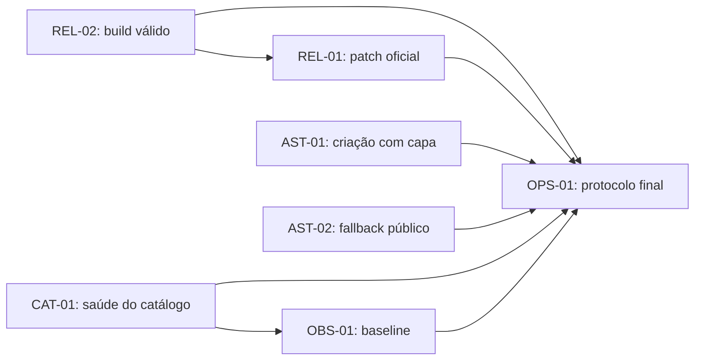

# Fase 0 — pacote de especificações

**Status:** revisão crítica aprovada, decomposta e publicada no tracker
**Origem:** plano mestre de evolução, decisões D1–D9 fechadas

## Objetivo

Remover bloqueadores de release e restaurar as invariantes mínimas de build,
assets, catálogo e observabilidade antes de iniciar melhorias de jogabilidade,
descoberta ou identidade visual.

Este pacote não possui datas-alvo. A execução avança por dependências e critérios
de saída, com no máximo dois épicos simultâneos. `ready-for-agent` significa que
uma spec já cabe em uma entrega; `ready-for-decomposition` ainda exige tickets
menores; `queued` e `blocked-external` não devem ser iniciados como se estivessem
livres.

## Specs

| Ordem lógica | Spec                                                                                                       | Estado                                      |
| ------------ | ---------------------------------------------------------------------------------------------------------- | ------------------------------------------- |
| 1            | [REL-02 — Contrato válido dos arquivos especiais do Next.js](./rel-02-contrato-arquivos-especiais-next.md) | `ready-for-agent`                           |
| 2            | [REL-01 — Patch crítico do Next.js](./rel-01-patch-critico-next.md)                                        | `blocked-external`: aguarda release oficial |
| 3            | [AST-01 — Capa persistida na criação do tema](./ast-01-capa-na-criacao.md)                                 | `ready-for-agent`                           |
| 4            | [AST-02 — Fallback público de capa quebrada](./ast-02-fallback-capa-quebrada.md)                           | `ready-for-agent`, independente de AST-01   |
| 5            | [CAT-01 — Visibilidade efetiva e saúde do tema](./cat-01-visibilidade-saude-tema.md)                       | `ready-for-decomposition`                   |
| 6            | [OBS-01 — Baseline operacional e de produto](./obs-01-baseline-operacional.md)                             | `ready-for-decomposition`                   |
| 7            | [OPS-01 — Gate de release e preflight](./ops-01-gate-release.md)                                           | `queued-for-integration`                    |

## Dependências

REL-02 vem antes de REL-01 porque o build atual precisa estar estruturalmente
válido para que a atualização de segurança seja verificada. AST-01 e AST-02 podem
avançar em paralelo: o primeiro corrige persistência; o segundo trata falha real de
URLs atuais e legadas. CAT-01 e a infraestrutura inicial de OBS-01 também podem ser
decompostos em paralelo, embora as métricas de catálogo dependam do vocabulário de
CAT-01.

OPS-01 integra as garantias ao fim; isso não impede que seus checks determinísticos
sejam incorporados incrementalmente. O patch crítico não aguardará trabalho visual
ou métricas não relacionadas quando o release oficial estiver disponível.

## Seams de teste

As specs escolhem a fronteira mais alta que ainda permite diagnóstico determinístico:

1. build/typegen real e GET HTTP dos manifests para arquivos especiais;
2. formulário administrativo → upload → Server Action → persistência para capas;
3. rede/browser → erro de imagem → fallback público, inclusive antes da hidratação;
4. mutação de saúde de uma Fonte → todos os Temas dependentes → criação de partida;
5. schema/redaction → reporter/exporter → agregado/snapshot para observabilidade;
6. gate de CI sem credenciais, preflight read-only e smoke mutável apenas em QA.

Testes unitários internos complementam essas fronteiras; não as substituem quando
o risco está na integração.

## Critérios de saída da Fase 0

- a versão do Next.js contém o patch crítico oficial e não há waiver para
  vulnerabilidade crítica conhecida;
- o build de produção e o build da fixture E2E passam;
- arquivos especiais exportam somente APIs aceitas pelo framework e manifests
  preservam o contrato HTTP;
- criar um Tema com capa persiste uma URL canônica derivada de referência gerenciada,
  compensa falhas controladas e deixa resíduos externos identificáveis;
- capa e thumbnails que falham caem para uma candidata válida ou placeholder sem
  layout shift, loop ou nome acessível duplicado;
- nenhum Tema público ou nova partida possui menos de quatro Entradas jogáveis;
- mudar a Disponibilidade de uma Fonte recalcula todos os Temas dependentes e não
  reintroduz indisponibilidade conhecida em rollback;
- contagens e perdas de suporte a 32/64 são visíveis no preflight, sem classificar
  os modos principais como “Maratona”;
- eventos mínimos possuem owner, retenção e redaction, sem conta obrigatória nem
  perfil comportamental do jogador;
- gate determinístico, preflight read-only e smoke controlado reproduzem as
  garantias no mesmo commit;
- format, lint, typegen/typecheck, testes, build, E2E e audit estão verdes; risco
  alto só admite aceite temporário de um release, enquanto crítico sempre bloqueia.

## Publicação no tracker

As specs foram decompostas em 29 issues abertas, publicadas em ordem de dependência
e com blockers numéricos. A issue histórica #1 foi reconciliada e encerrada como
substituída pelo plano vigente. REL-02 #5, AST-01 #6, AST-02 #7, CAT-02 #8, CAT-03
#9 e OBS-02 #10 formam a fronteira inicial com `ready-for-agent`; nenhuma issue foi
atribuída durante a publicação.

O mapa completo, a reconciliação e a operação da fronteira estão em
[Proposta de tickets](./proposta-tickets.md).
