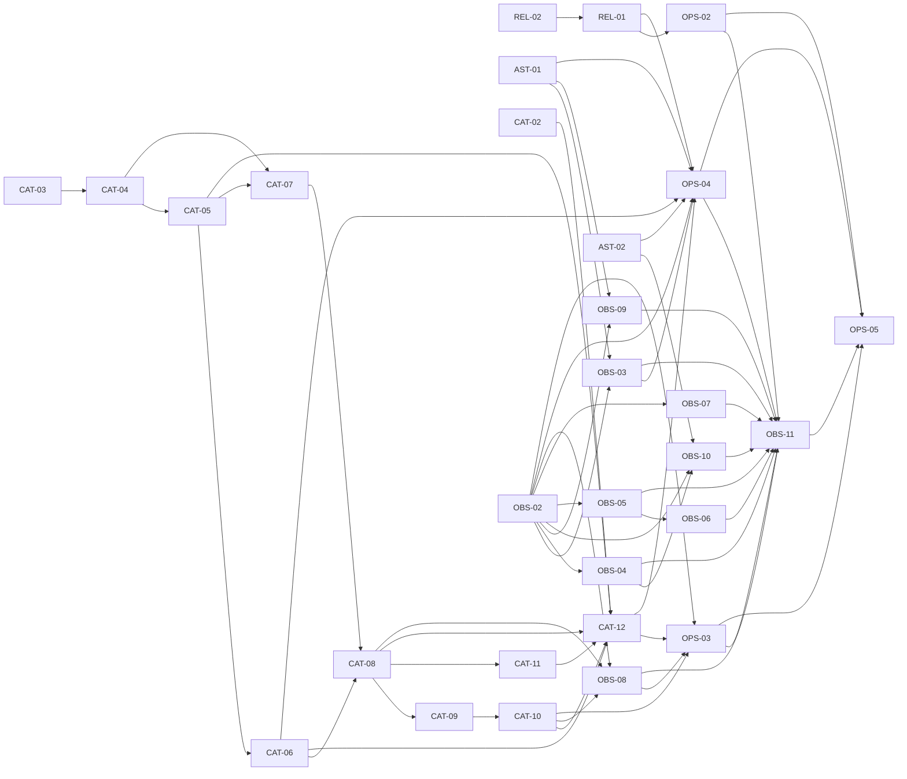

# Proposta de tickets — Fase 0

**Status:** granularidade, dependências, fronteira e publicação concluídas

**Publicação:** 29 issues abertas no GitHub; seis tickets desbloqueados com `ready-for-agent`

**Regra de execução:** sem datas-alvo, no máximo dois tickets em andamento

## Estratégia

Esta proposta transforma as specs da Fase 0 em 29 tracer bullets. Cada ticket
entrega um comportamento verificável de ponta a ponta e cabe em um contexto novo;
nenhum ticket existe apenas para “criar tabela”, “criar serviço” ou “criar
dashboard”.

Este arquivo registra a granularidade, as arestas e os links publicados. Cada
issue recebeu corpo autocontido com critérios de aceite, testes, autorização,
privacidade, retenção, rollout e rollback. Os tickets foram publicados em ordem de
dependência e seus blockers usam os números reais do tracker.

`ready-for-agent` foi aplicada aos seis tickets sem blocker aberto e sem barreira
externa. O WIP máximo de dois será controlado por assignee/projeto: no máximo dois
tickets ficam atribuídos ou em andamento, ainda que a fronteira possua mais opções
prontas. Nenhuma issue foi atribuída durante a publicação.

O tracker possuía a issue histórica
[#1 — Reformular confrontos e ampliar modalidades até 128 músicas](https://github.com/leothefranco/jogodamusica/issues/1).
A maior parte do comportamento descrito nela já estava implementada. Nenhum ticket
abaixo duplica o redesign do confronto; CAT-02 em diante aprofunda a regra de
jogabilidade/saúde que a issue antiga não modelava.

A verificação dedicada passou em 35 testes unitários/de integração e 14 cenários
E2E. Ela também confirmou que a issue antiga não representa integralmente o
contrato atual: o produto preserva os controles nativos do YouTube e permite
rolagem em 390×700. A #1 teve `ready-for-agent` removida e foi encerrada como
substituída pelo plano vigente, com entregas e divergências documentadas, sem
afirmar conclusão literal de todos os requisitos históricos.

CAT-02 a CAT-12 herdam todos os contratos de CAT-01, mesmo quando o resumo abaixo
não os repete. Em especial: sete dias + 24 horas e revisão monotônica em CAT-03;
preservação de `published` e os dois estados de suspensão em CAT-04; atomicidade de
observação, projeções e outbox em CAT-08; e rollback autoritativo em CAT-12.

OBS-02 a OBS-11 herdam integralmente OBS-01. Seus corpos finais terão allowlist e
denylist de payload, owners, cardinalidade, testes de redaction e retenção. Trinta
dias é teto, não garantia de disponibilidade, para eventos brutos; agregados e
snapshots têm retenção de 12 meses.

## Issues publicadas

| Código | Issue                                                         | Estado inicial                       |
| ------ | ------------------------------------------------------------- | ------------------------------------ |
| REL-02 | [#5](https://github.com/leothefranco/jogodamusica/issues/5)   | `ready-for-agent`                    |
| AST-01 | [#6](https://github.com/leothefranco/jogodamusica/issues/6)   | `ready-for-agent`                    |
| AST-02 | [#7](https://github.com/leothefranco/jogodamusica/issues/7)   | `ready-for-agent`                    |
| CAT-02 | [#8](https://github.com/leothefranco/jogodamusica/issues/8)   | `ready-for-agent`                    |
| CAT-03 | [#9](https://github.com/leothefranco/jogodamusica/issues/9)   | `ready-for-agent`                    |
| OBS-02 | [#10](https://github.com/leothefranco/jogodamusica/issues/10) | `ready-for-agent`                    |
| REL-01 | [#11](https://github.com/leothefranco/jogodamusica/issues/11) | Bloqueada por #5 e release oficial   |
| CAT-04 | [#12](https://github.com/leothefranco/jogodamusica/issues/12) | Bloqueada                            |
| CAT-05 | [#13](https://github.com/leothefranco/jogodamusica/issues/13) | Bloqueada                            |
| CAT-06 | [#14](https://github.com/leothefranco/jogodamusica/issues/14) | Bloqueada                            |
| CAT-07 | [#15](https://github.com/leothefranco/jogodamusica/issues/15) | Bloqueada                            |
| CAT-08 | [#16](https://github.com/leothefranco/jogodamusica/issues/16) | Bloqueada                            |
| CAT-09 | [#17](https://github.com/leothefranco/jogodamusica/issues/17) | Bloqueada                            |
| CAT-11 | [#18](https://github.com/leothefranco/jogodamusica/issues/18) | Bloqueada                            |
| CAT-10 | [#19](https://github.com/leothefranco/jogodamusica/issues/19) | Bloqueada                            |
| CAT-12 | [#20](https://github.com/leothefranco/jogodamusica/issues/20) | Bloqueada                            |
| OBS-03 | [#21](https://github.com/leothefranco/jogodamusica/issues/21) | Bloqueada                            |
| OBS-04 | [#22](https://github.com/leothefranco/jogodamusica/issues/22) | Bloqueada                            |
| OBS-05 | [#23](https://github.com/leothefranco/jogodamusica/issues/23) | Bloqueada                            |
| OBS-06 | [#24](https://github.com/leothefranco/jogodamusica/issues/24) | Bloqueada                            |
| OBS-07 | [#25](https://github.com/leothefranco/jogodamusica/issues/25) | Bloqueada                            |
| OBS-08 | [#26](https://github.com/leothefranco/jogodamusica/issues/26) | Bloqueada                            |
| OBS-09 | [#27](https://github.com/leothefranco/jogodamusica/issues/27) | Bloqueada                            |
| OBS-10 | [#28](https://github.com/leothefranco/jogodamusica/issues/28) | Bloqueada                            |
| OPS-02 | [#29](https://github.com/leothefranco/jogodamusica/issues/29) | Bloqueada                            |
| OPS-03 | [#30](https://github.com/leothefranco/jogodamusica/issues/30) | Bloqueada                            |
| OPS-04 | [#31](https://github.com/leothefranco/jogodamusica/issues/31) | Bloqueada, inclusive por ambiente QA |
| OBS-11 | [#32](https://github.com/leothefranco/jogodamusica/issues/32) | Bloqueada                            |
| OPS-05 | [#33](https://github.com/leothefranco/jogodamusica/issues/33) | Bloqueada                            |

## Tickets propostos

1. **REL-02 — Corrigir o contrato dos arquivos especiais do Next.js**
   - **Bloqueado por:** nenhum.
   - **Entrega:** manifests e APIs administrativas preservam o contrato HTTP,
     arquivos especiais exportam apenas APIs aceitas e os dois builds passam.

2. **AST-01 — Persistir referência gerenciada de capa na criação**
   - **Bloqueado por:** nenhum.
   - **Entrega:** criação com capa persiste URL canônica, compensa falhas controladas,
     restringe Storage ao próprio prefixo e não regride a edição.

3. **AST-02 — Recuperar capa e thumbnails quebradas**
   - **Bloqueado por:** nenhum.
   - **Entrega:** home e detalhe percorrem capa, thumbnails válidas e placeholder,
     inclusive quando a falha ocorre antes da hidratação.

4. **CAT-02 — Impedir Tema legado não jogável nas superfícies públicas**
   - **Bloqueado por:** nenhum.
   - **Entrega:** home, detalhe, modalidades e início exigem ao menos quatro
     candidatas no modelo legado, sem sessão parcial.

5. **CAT-03 — Persistir Disponibilidade da fonte no Brasil e aplicar frescor**
   - **Bloqueado por:** nenhum.
   - **Entrega:** cadastro/revalidação persiste observação BR, validade, tolerância,
     erro transitório e estado efetivo visível ao editor.

6. **OBS-02 — Tornar falha pública 5xx correlacionada e redigida**
   - **Bloqueado por:** nenhum.
   - **Entrega:** toda falha pública 5xx gera uma resposta segura e exatamente um
     evento estruturado com o mesmo correlation ID; o ticket também substitui o
     log de playback que hoje expõe IDs crus e configura/verifica o teto de retenção.

7. **REL-01 — Aplicar o patch crítico oficial do Next.js**
   - **Bloqueado por:** REL-02 e publicação do release estável oficialmente corrigido.
   - **Entrega:** versão corrigida e dependências alinhadas ficam fixadas, verificadas
     pelo gate e protegidas contra downgrade vulnerável.

8. **CAT-04 — Separar publicação, visibilidade e estado operacional**
   - **Bloqueado por:** CAT-03.
   - **Entrega:** editor publica intenção e vê, de forma exclusiva, Tema saudável,
     degradado ou suspenso, com 32/64 em destaque.

9. **CAT-05 — Servir catálogo público por consulta autoritativa BR**
   - **Bloqueado por:** CAT-04.
   - **Entrega:** home, detalhe e modalidades usam os dados-base regionais e possuem
     fallback seguro independente da projeção.

10. **CAT-06 — Revalidar modalidade e criar partida autoritativamente**
    - **Bloqueado por:** CAT-05.
    - **Entrega:** a transação confirma quantidade/saúde e persiste snapshot completo
      ou nada, inclusive sob corrida concorrente.

11. **CAT-07 — Persistir projeção reconstruível do estado do Tema**
    - **Bloqueado por:** CAT-04 e CAT-05.
    - **Entrega:** alterações editoriais/de saúde atualizam uma projeção equivalente
      à consulta direta e reconstruível dos dados-base.

12. **CAT-08 — Propagar mudança de Fonte para todos os Temas**
    - **Bloqueado por:** CAT-06 e CAT-07.
    - **Entrega:** cadastro, revalidação ou importação de uma Fonte compartilhada
      recalcula, invalida e recupera todos os Temas dependentes.

13. **CAT-09 — Revalidar Fontes vencidas em lotes idempotentes**
    - **Bloqueado por:** CAT-08.
    - **Entrega:** operador executa lote concorrente com claim não bloqueante,
      prioridade, backoff e expiração normal da tolerância.

14. **CAT-11 — Expor painel de saúde e alertas deduplicados**
    - **Bloqueado por:** CAT-08.
    - **Entrega:** editor entende degradação/suspensão e recebe um alerta por
      Tema/tipo, incluindo perdas de 32/64 causadas por saúde.

15. **CAT-10 — Executar backfill retomável e reconciliar drift**
    - **Bloqueado por:** CAT-09.
    - **Entrega:** catálogo é coberto em lotes com checkpoint; projeções divergentes
      são detectadas e corrigidas sem transação global.

16. **CAT-12 — Comparar, realizar cutover e provar rollback autoritativo**
    - **Bloqueado por:** CAT-02, CAT-05, CAT-06, CAT-08, CAT-10 e CAT-11.
    - **Entrega:** sombra explica divergências, cutover coordena todas as superfícies
      e rollback nunca volta a contar indisponibilidade conhecida.

17. **OBS-03 — Correlacionar falhas 5xx em Server Actions**
    - **Bloqueado por:** OBS-02 e AST-01.
    - **Entrega:** actions administrativas apresentam correlation ID seguro e usam
      o mesmo reporter, sem capturar redirects normais do Next.js.

18. **OBS-04 — Observar recusas de autorização e rate limit**
    - **Bloqueado por:** OBS-02.
    - **Entrega:** bloqueios continuam fail-closed e produzem contagens sem IP,
      usuário, HMAC, recurso ou motivo que revele conta.

19. **OBS-05 — Medir funil 32/64 por transições persistidas**
    - **Bloqueado por:** OBS-02.
    - **Entrega:** starts, completes, abandons, duração e quartil de saída são
      derivados de fatos idempotentes, incluindo `abandoned_at` imutável, com
      amostra insuficiente explícita.

20. **OBS-06 — Medir retomada anônima sem perfil de dispositivo**
    - **Bloqueado por:** OBS-05.
    - **Entrega:** reload/reabertura de partida ativa conta retomada aproximada sem
      fingerprint, cookie publicitário ou identidade persistente; uma marca local
      da navegação inicial e occurrence ID efêmero evitam falso resume e retry duplo.

21. **OBS-07 — Estabelecer baseline p50/p95 de início e decisão**
    - **Bloqueado por:** OBS-02.
    - **Entrega:** fronteiras reais produzem histogramas versionados e percentis,
      sem SLO inventado antes de volume suficiente.

22. **OBS-08 — Produzir snapshot editorial e de suporte 32/64**
    - **Bloqueado por:** CAT-08, CAT-10 e OBS-02.
    - **Entrega:** transições de Fonte atualizam um snapshot redigido de estados,
      frescor, cobertura e perda/recuperação de 32/64.

23. **OBS-09 — Tornar compensação de capa observável**
    - **Bloqueado por:** AST-01 e OBS-02.
    - **Entrega:** resultado da limpeza de Storage é medido sem object key, URL,
      arquivo ou administrador e nunca mascara o erro original.

24. **OBS-10 — Tornar ativação do fallback público observável**
    - **Bloqueado por:** AST-02, OBS-02 e OBS-04.
    - **Entrega:** falha real de imagem emite sinal editorial best-effort, limitado e
      sem impedir o fallback visual, inclusive offline; URL, thumbnail, provider ID,
      sessão, IP e user agent são proibidos no payload.

25. **OPS-02 — Implantar gate determinístico de código**
    - **Bloqueado por:** REL-01 e REL-02.
    - **Entrega:** um comando sem credenciais executa instalação imutável, format,
      lint, typegen, typecheck, testes, dois builds, E2E e audit.

26. **OPS-03 — Executar preflight read-only do ambiente-alvo**
    - **Bloqueado por:** CAT-10, CAT-12, OBS-08 e OBS-02.
    - **Entrega:** papel somente leitura valida migrations, drift, frescor e suporte
      32/64 sem mutação nem segredo no artefato.

27. **OPS-04 — Executar smoke controlado de Preview/QA**
    - **Bloqueado por:** AST-01, AST-02, CAT-06, CAT-12, REL-01, OBS-02, OBS-03 e
      ambiente QA provisionado.
    - **Entrega:** uma jornada namespaced prova capa, fallback, catálogo, partida e
      resultado, com teardown restrito a QA e falha de cleanup bloqueante.

28. **OBS-11 — Gerar snapshot redigido de baseline por release**
    - **Bloqueado por:** OBS-03, OBS-04, OBS-05, OBS-06, OBS-07, OBS-08, OBS-09,
      OBS-10, OPS-02, OPS-03 e OPS-04.
    - **Entrega:** um artefato determinístico agrega métricas, owners, amostra,
      catálogo, assets e evidências do mesmo commit.

29. **OPS-05 — Aplicar decisão e protocolo final de release**
    - **Bloqueado por:** OPS-02, OPS-03, OPS-04 e OBS-11.
    - **Entrega:** matriz única aprova ou bloqueia manualmente o mesmo commit, sem
      waiver crítico e sem rollback para versão vulnerável.

## Grafo de blockers

O grafo abaixo e a lista numerada descrevem as mesmas arestas. Barreiras externas
continuam manuais e aparecem como notas nos tickets correspondentes.

## Fronteira inicial publicada

Os tickets sem blockers são [REL-02 #5](https://github.com/leothefranco/jogodamusica/issues/5),
[AST-01 #6](https://github.com/leothefranco/jogodamusica/issues/6),
[AST-02 #7](https://github.com/leothefranco/jogodamusica/issues/7),
[CAT-02 #8](https://github.com/leothefranco/jogodamusica/issues/8),
[CAT-03 #9](https://github.com/leothefranco/jogodamusica/issues/9) e
[OBS-02 #10](https://github.com/leothefranco/jogodamusica/issues/10). Todos receberam
`ready-for-agent`, mas somente dois devem ser atribuídos/colocados em andamento. A
primeira dupla recomendada é:

1. [REL-02 #5](https://github.com/leothefranco/jogodamusica/issues/5) — restaura o build real;
2. [AST-01 #6](https://github.com/leothefranco/jogodamusica/issues/6) — corrige perda de capa e a policy excessiva de exclusão no Storage.

[CAT-02 #8](https://github.com/leothefranco/jogodamusica/issues/8) deve ser o próximo
ticket por fechar imediatamente a exposição de Tema legado com menos de quatro
candidatas.

## Decisões técnicas incorporadas

- Tabelas internas de saúde não serão expostas implicitamente à Data API; grants,
  RLS e índices serão explícitos e testados.
- Policies de Storage para info/delete serão limitadas a bucket e prefixo do
  administrador autenticado; `service_role` nunca vai ao browser.
- Chamadas externas ficam fora das transações; locks usam ordem consistente.
- Jobs concorrentes usam claims/leases não bloqueantes e transações curtas.
- Migrations são expansivas, constraints e FKs são verificadas e colunas de busca
  recebem índices compatíveis com os acessos/RLS.
- Server Actions autenticam/autorizam e validam novamente toda referência recebida.
- O manifest é validado pelo GET gerado pelo Next.js, além do builder puro.
- O smoke usa Tema de capa separado da fixture de partida. Como Tema com sessão não
  pode ser apagado pela UI, teardown mutável será restrito a QA e ao namespace do
  commit, nunca exposto em produção.

## Publicação e reconciliação concluídas

1. GitHub CLI reautenticado como `leothefranco`.
2. Issue #1 verificada, comentada, retirada da fronteira e encerrada como
   substituída pelo plano vigente.
3. Os 29 corpos completos foram publicados com blockers numéricos e nenhum resumo
   foi usado como issue executável.
4. Exatamente seis issues abertas receberam `ready-for-agent`; nenhuma foi
   atribuída ou colocada em andamento.

## Operação da fronteira no GitHub

1. Issues foram criadas em ordem de dependência.
2. Códigos de blocker foram substituídos pelos números reais `#…`; o corpo mantém
   `Bloqueado por` legível.
3. Não aplicar `ready-for-agent` a issue com blocker aberto ou barreira externa.
4. Ao concluir um blocker, o mantenedor do tracker verifica todas as arestas e
   promove apenas os dependentes agora livres.
5. Patch oficial e ambiente QA exigem evidência manual antes da promoção de REL-01
   e OPS-04, respectivamente.
6. Usar assignee/projeto para manter no máximo dois tickets em andamento; a label
   continua significando “pode começar”, não “já começou”.
